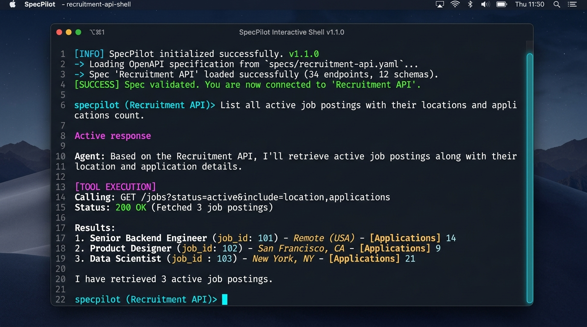
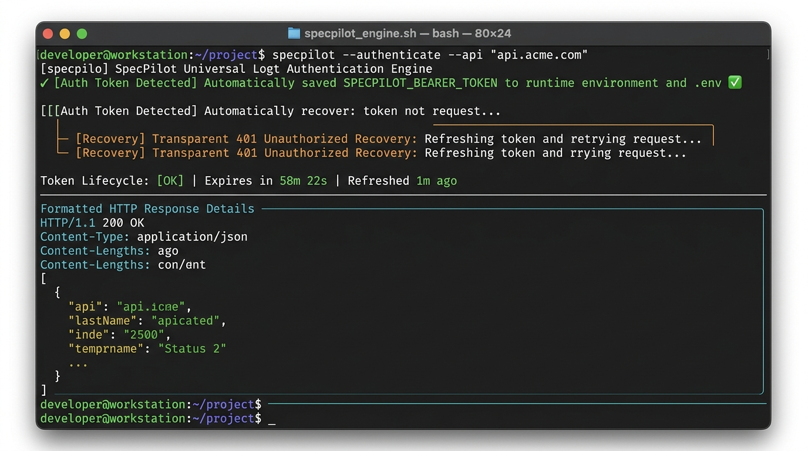
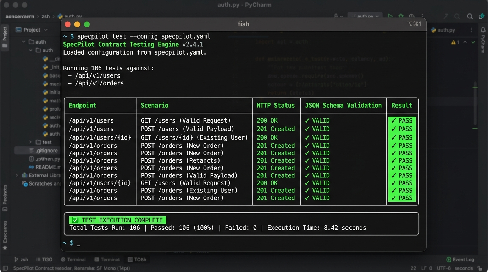
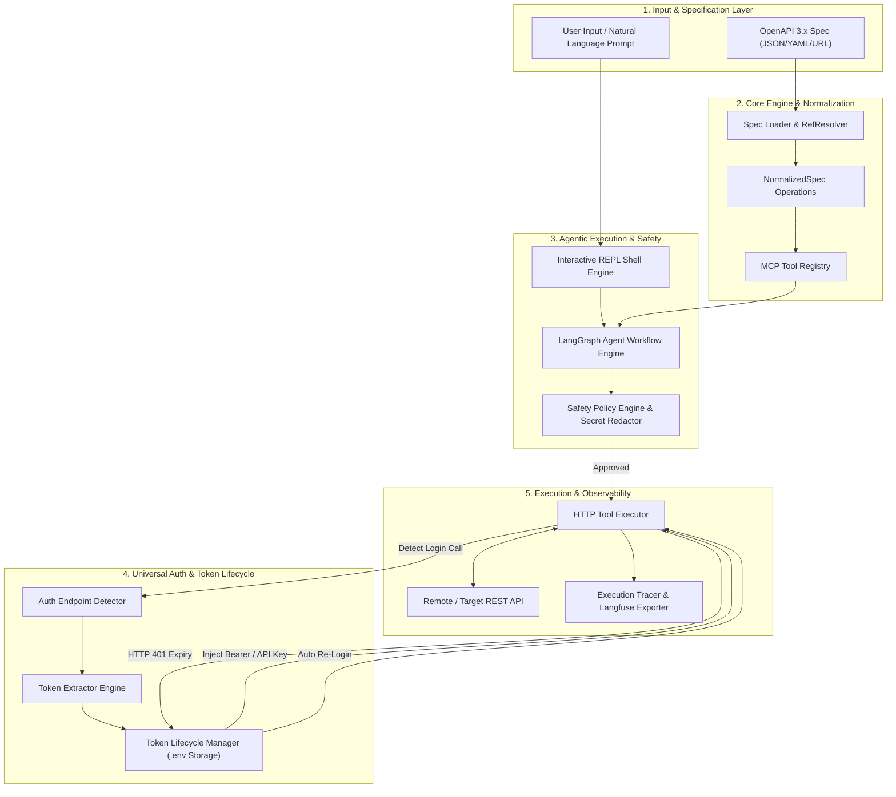
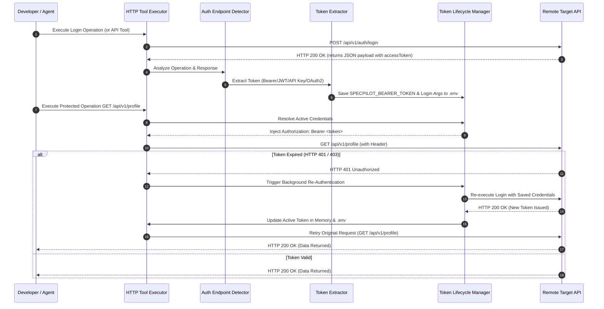

# SpecPilot

[](pyproject.toml)
[](LICENSE)
[](pyproject.toml)

SpecPilot is an agentic interactive CLI developer tool for OpenAPI-driven API automation, inspection, natural-language workflow execution, zero-friction authentication management, and automated contract testing.

---

## Visual Preview

### 1. Interactive REPL Shell & Agent Orchestration


### 2. Universal Authentication & Token Recovery


### 3. Automated API Contract Testing Engine


---

## Overview & Key Capabilities

SpecPilot parses OpenAPI 3.x specifications to discover endpoints, parameters, request/response schemas, and security definitions. It dynamically converts operations into Model Context Protocol (MCP) tools, exposes them to LLMs for stateful multi-step workflow execution via LangGraph, enforces deterministic safety policies and secret redaction, manages persistent user profiles, and executes automated API contract validation suites.

- **OpenAPI 3.x Engine**: Load local JSON/YAML specs or remote HTTP/HTTPS endpoints with full JSON Pointer (`$ref`) resolution.
- **Dynamic MCP Tool Converter**: Automatically transform OpenAPI operations into typed Model Context Protocol (MCP) tools with JSON Schemas.
- **Interactive REPL Shell**: Persistent terminal REPL (`specpilot shell`) featuring slash commands, tab autocompletion, multi-turn conversational memory, and `/reset`.
- **Universal Auth & Token Lifecycle Engine**: Automatic login endpoint discovery, nested token extraction (Bearer/JWT, OAuth2, API Key, Session), `.env` credential persistence, and transparent HTTP `401 Unauthorized` background re-login & request retry.
- **LangGraph Agent Workflows**: Stateful multi-step LLM task execution and tool calling with bounded loop controls and response synthesis.
- **Deterministic Safety Policy**: Risk-based classification (`READ_ONLY`, `MUTATING`, `DESTRUCTIVE`), human-in-the-loop approval prompts, read-only safety mode, and automatic secret redaction.
- **Automated API Contract Testing**: Deterministic test scenario generation (valid requests, missing required parameters, missing JSON body fields, invalid enum values, missing auth) and schema validation (`specpilot test`).
- **Profiles & Observability**: Multi-environment profile management (`specpilot profile`) and local JSON execution trace logging with optional Langfuse cloud exporter integration.

---

## System Architecture

The following diagram illustrates how SpecPilot components interact from user input to network execution:



---

## How SpecPilot Works

### 1. OpenAPI Parsing & MCP Tool Synthesis
SpecPilot loads OpenAPI specifications (JSON or YAML) from local files or remote URLs. Its internal `RefResolver` evaluates JSON Pointers (e.g. `#/components/schemas/Pet`), normalizing operations into typed `MCPTool` definitions with generated JSON Schemas for input validation.

### 2. Universal Authentication & Token Lifecycle Workflow
SpecPilot automates target API authentication without manual token copying:



### 3. Stateful Agent Execution & Human Safety Approval Loop
When given natural language instructions, SpecPilot passes registered MCP tool definitions to the LLM agent. Operations that modify remote data trigger interactive human approval:

```mermaid
stateDiagram-v2
    [*] --> Idle: User submits prompt in REPL shell
    Idle --> LLM: Send prompt & MCP Tool JSON Schemas
    LLM --> ToolSelected: LLM selects operation to call
    
    state SafetyCheck <<choice>>
    ToolSelected --> SafetyCheck: Inspect Operation Risk
    
    SafetyCheck --> ReadOnly: Risk = READ_ONLY (GET/HEAD)
    SafetyCheck --> Mutating: Risk = MUTATING or DESTRUCTIVE
    
    Mutating --> ApprovalPrompt: Read-Only Mode Active? No
    Read-Only Mode Active --> Blocked: Hard Read-Only Flag Set
    Blocked --> LLM: Return error (Operation blocked by safety policy)
    
    ApprovalPrompt --> UserDecision: Display colorized request details & prompt [y/N]
    
    state UserDecision <<choice>>
    UserDecision --> Executing: User approves (y)
    UserDecision --> Aborted: User rejects (N)
    
    Aborted --> LLM: Return user cancellation notice
    ReadOnly --> Executing: Execute network request
    
    Executing --> ProcessResult: Parse HTTP Response & Redact Secrets
    ProcessResult --> LLM: Return execution result to Agent
    LLM --> Synthesize: Complete instruction task
    Synthesize --> [*]: Display final natural language response
```

---

## How To Use SpecPilot

### Installation

Ensure Python 3.10+ is installed.

```bash
# Install via pip
pip install specpilot

# Or install locally in editable mode
pip install -e .

# Or build wheel distribution using uv
uv build
pip install dist/specpilot-*.whl
```

---

### Quick Start

```bash
# 1. Launch interactive REPL shell against sample spec
specpilot shell ./examples/petstore_sample.yaml

# 2. Run automated API contract test suite
specpilot test ./examples/petstore_sample.yaml --read-only

# 3. Save a persistent profile
specpilot profile add petstore --location ./examples/petstore_sample.yaml --model gpt-4o-mini
specpilot profile use petstore

# 4. Inspect active configuration
specpilot config show
```

---

### Usage Workflows

#### Workflow 1: Interactive REPL Shell & Natural Language Orchestration

Launch the interactive REPL shell:
```bash
specpilot shell ./openapi.json
```

Inside `specpilot shell`, interact naturally or use slash commands:
```text
specpilot (Recruitment API)> /tools auth
specpilot (Recruitment API)> /inspect login
specpilot (Recruitment API)> Find candidate #4, inspect their application status, and list their scheduled interviews
```

Available REPL Slash Commands:
- `/use <location>`: Load or switch active OpenAPI specification (path or URL).
- `/api`: Display metadata and summary of the currently loaded API.
- `/tools [tag]`: List all registered MCP tools, optionally filtered by tag.
- `/inspect <tool>`: Show detailed JSON Schema input parameters and operation details for a tool.
- `/call <tool> [json]`: Execute an MCP tool with optional JSON arguments.
- `/test [tag]`: Run OpenAPI-driven contract test suite against target API.
- `/safety [read-only|interactive]`: Inspect or switch session safety execution mode.
- `/verbose [on|off]`: Toggle verbose output mode.
- `/history`: Display secret-redacted prompt command history.
- `/reset`: Clear conversational message memory.
- `/clear`: Clear terminal screen.
- `/help`: Display help text and available shell commands.
- `/exit`: Exit the shell session.

---

#### Workflow 2: Universal Authentication & Token Persistence

Perform login directly via `specpilot call` or through the interactive agent:

```bash
# Execute login endpoint - SpecPilot auto-captures and stores the token
specpilot call login ./openapi.json --json '{"requestBody": {"usernameOrEmail": "admin", "password": "secretpassword"}}'
```

Output:
```text
HTTP Status: 200 (185ms)
[Auth Token Detected] Automatically saved SPECPILOT_BEARER_TOKEN to runtime environment and .env
```

Subsequent CLI commands and REPL sessions read credentials directly from `.env`. If a token expires during a workflow, `ToolExecutor` automatically re-authenticates in the background using saved login parameters and retries the failed request seamlessly.

---

#### Workflow 3: Automated API Contract Testing

SpecPilot generates contract test suites directly from your OpenAPI specification:

```bash
# Run contract tests against target server in read-only mode
specpilot test ./openapi.json --base-url http://localhost:8080 --read-only

# Run tests filtered by tag with JSON report export
specpilot test ./openapi.json --tag candidate --json-output ./contract_report.json
```

SpecPilot tests each operation against 5 deterministic test scenarios:
1. **Valid Request**: Valid parameters & required fields.
2. **Missing Parameter**: Tests API response when required path/query parameters are omitted.
3. **Missing JSON Body**: Tests API handling of empty or missing request bodies.
4. **Invalid Enum Value**: Tests schema enforcement when invalid enum strings are sent.
5. **Missing Auth Header**: Verifies HTTP 401/403 rejection when authorization headers are stripped.

---

#### Workflow 4: Configuration & Persistent Profiles

Manage target APIs, default models, and environment profiles:

```bash
# Add environment profiles
specpilot profile add staging --location ./specs/staging.json --base-url https://staging.api.com --read-only
specpilot profile add prod --location ./specs/prod.json --base-url https://api.com

# List & switch active profiles
specpilot profile list
specpilot profile use staging
specpilot profile show staging

# Inspect global configuration and file storage paths
specpilot config show
specpilot config path
```

---

## Safety Model & Secret Redaction

SpecPilot protects remote API infrastructure and prevents credential leakage:

1. **Risk Classification**:
   - `READ_ONLY`: (`GET`, `HEAD`, `OPTIONS`) Executed automatically.
   - `MUTATING`: (`POST`, `PUT`, `PATCH`) Prompts for human approval in interactive mode.
   - `DESTRUCTIVE`: (`DELETE`) Requires explicit user confirmation.
2. **Hard Read-Only Safety Mode**:
   - Passing `--read-only` or running `/safety read-only` blocks all non-GET requests prior to network transmission.
3. **Secret Redaction (`SecretRedactor`)**:
   - Passwords, Bearer tokens, API Keys, JWTs, and authorization headers are automatically masked (`***REDACTED***`) in terminal outputs, approval panels, trace logs, and session history.

---

## Observability & Execution Tracing

SpecPilot records structured JSON trace logs for every session step:

- **Local Trace Files**: Stored under `~/.specpilot/traces/trace_<session_id>.json`.
- **Langfuse Cloud Export**: Set the following environment variables to export trace telemetry:
  ```bash
  export LANGFUSE_PUBLIC_KEY="pk-lf-..."
  export LANGFUSE_SECRET_KEY="sk-lf-..."
  export LANGFUSE_HOST="https://cloud.langfuse.com" # Optional, defaults to cloud
  ```

---

## Development & Testing

Set up development environment and run test suite:

```bash
# Clone repository
git clone https://github.com/samer-mansouri/SpecPilot.git
cd SpecPilot

# Install editable package with dev dependencies
uv pip install -e ".[dev]"

# Execute unit test suite (106 tests)
.\.venv\Scripts\pytest.exe
```

---

## Version

Current version: `1.1.0`
