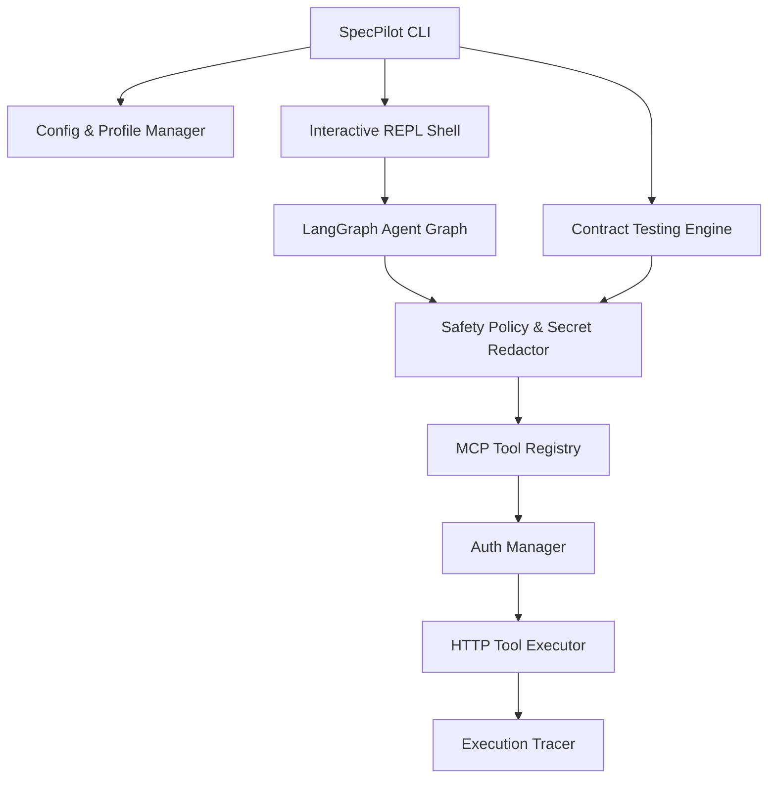

# SpecPilot

SpecPilot is an agentic interactive CLI developer tool for OpenAPI-driven API automation, inspection, workflow execution, and contract testing.

## Overview

SpecPilot parses OpenAPI 3.x specifications to discover endpoints, parameters, request/response models, and security definitions. It dynamically converts API operations into Model Context Protocol (MCP) tools, exposes them to LLMs for multi-step workflow execution via LangGraph, enforces safety policies and secret redaction, manages persistent user profiles, and executes automated API contract validation suites.

## Core Capabilities

- **OpenAPI 3.x Parsing**: Load local JSON/YAML files or remote HTTP/HTTPS specifications with full `$ref` resolution.
- **Dynamic MCP Tool Conversion**: Convert OpenAPI operations into typed Model Context Protocol (MCP) tools with JSON Schemas.
- **Interactive REPL Shell**: Persistent interactive shell (`specpilot shell`) with slash commands, tab autocompletion, and natural-language tool orchestration.
- **LangGraph Agent Workflows**: Stateful multi-step LLM task execution and tool calling with bounded loop controls.
- **Safety Policy & Secret Redaction**: Risk-based classification (`READ_ONLY`, `MUTATING`, `DESTRUCTIVE`), human-in-the-loop approval, read-only mode, and automatic credential redaction.
- **API Contract Testing**: Deterministic scenario generation (valid request, missing param, missing body, invalid enum, missing auth) and schema validation (`specpilot test`).
- **Target API Authentication**: Built-in support for Bearer tokens, API Keys (header or query), and Basic Authentication.
- **Configuration & Profiles**: Persistent configuration profiles (`specpilot profile`) and global setting inspection (`specpilot config`).
- **Structured Execution Tracing**: Local JSON trace logging and optional Langfuse exporter integration.

## Installation

Ensure Python 3.10+ is installed.

```bash
# Install package via pip
pip install specpilot

# Or install locally in editable mode
pip install -e .

# Or build wheel distribution using uv
uv build
pip install dist/specpilot-*.whl
```

Once installed, the `specpilot` executable entry point is available globally.

## Quick Start

```bash
# 1. Launch interactive REPL shell against sample spec
specpilot shell ./examples/petstore_sample.yaml

# 2. Run automated API contract test suite
specpilot test ./examples/petstore_sample.yaml --read-only

# 3. Save a persistent profile
specpilot profile add petstore --location ./examples/petstore_sample.yaml --model gpt-4o-mini
specpilot profile use petstore

# 4. Inspect active configuration
specpilot config show
```

## Interactive CLI

Launch the interactive REPL shell:

```bash
specpilot shell [specification-path-or-url] [--read-only]
```

Slash commands available in `specpilot shell`:

- `/use <location>`: Load and switch to a different OpenAPI specification.
- `/api`: Display metadata and summary of the currently loaded API.
- `/tools [tag]`: List all registered MCP tools, optionally filtered by tag.
- `/inspect <tool>`: Show detailed JSON Schema input parameters and operation details for a tool.
- `/call <tool> [json]`: Execute an MCP tool with optional JSON arguments.
- `/test [tag]`: Run OpenAPI-driven contract test suite against target API.
- `/safety [read-only|interactive]`: Inspect or switch session safety execution mode.
- `/verbose [on|off]`: Toggle verbose output mode.
- `/history`: Display secret-redacted prompt command history.
- `/clear`: Clear terminal screen.
- `/help`: Display help text and available shell commands.
- `/exit`: Exit the shell session.

## OpenAPI to MCP

SpecPilot dynamically transforms OpenAPI operations into Model Context Protocol (MCP) tools:

```bash
# Inspect all generated MCP tools
specpilot tools ./examples/petstore_sample.yaml

# Inspect input JSON Schema for a tool
specpilot inspect findPetsByStatus ./examples/petstore_sample.yaml

# Manually invoke an MCP tool against target API
specpilot call findPetsByStatus ./examples/petstore_sample.yaml --json '{"status": "available"}'
```

## Agent Workflows

SpecPilot integrates LangGraph stateful agent workflows to execute multi-step natural language instructions:

1. User submits natural-language task (e.g. "Find all available pets and summarize their names").
2. SpecPilot passes task and MCP tool definitions to LLM.
3. LLM executes tool calls sequentially, updating session state.
4. Final synthesized natural-language response is presented to user.

## Safety Model

SpecPilot includes a built-in Safety Policy Engine (`SafetyPolicy`) to protect target API data:

- **Read-Only (`GET`, `HEAD`, `OPTIONS`)**: Executed automatically.
- **Mutating (`POST`, `PUT`, `PATCH`)**: Requires human confirmation before execution in interactive mode.
- **Destructive (`DELETE`)**: Always requires explicit human approval.
- **Read-Only Mode (`--read-only` flag or `/safety read-only`)**: Hard-enforces read-only execution by blocking all mutating/destructive requests prior to network execution.

## API Contract Testing

SpecPilot automatically derives deterministic contract test cases directly from OpenAPI specifications:

```bash
# Run contract tests against target base URL in read-only mode
specpilot test ./examples/petstore_sample.yaml --base-url https://petstore.swagger.io/v2 --read-only

# Run tests filtered by tag with JSON report export
specpilot test ./examples/petstore_sample.yaml --tag pet --json-output ./contract_report.json
```

## Authentication

SpecPilot supports common target API authentication mechanisms:

- **Bearer Token**: Set `SPECPILOT_BEARER_TOKEN="your_token"` or pass `--bearer-token`.
- **API Key**: Set `SPECPILOT_API_KEY="your_key"`, `SPECPILOT_API_KEY_NAME="X-API-Key"`, `SPECPILOT_API_KEY_IN="header"` (or `"query"`).
- **Basic Auth**: Set `SPECPILOT_BASIC_USER="user"` and `SPECPILOT_BASIC_PASS="pass"`.

All credentials are kept out of trace logs, terminal outputs, and approval prompts via automatic secret redaction.

## Configuration and Profiles

SpecPilot supports persistent configuration profiles to manage target APIs and model options:

```bash
# Manage profiles
specpilot profile add production --location ./openapi.yaml --base-url https://api.example.com --read-only
specpilot profile list
specpilot profile use production
specpilot profile show production
specpilot profile remove production

# Inspect global configuration and storage path
specpilot config show
specpilot config path
```

## Observability

SpecPilot records structured JSON execution trace logs for session commands, model calls, MCP tool invocations, latencies, and approvals:

- **Local Trace Files**: Saved under `~/.specpilot/traces/trace_<session_id>.json`.
- **Optional Langfuse Integration**: Set `LANGFUSE_PUBLIC_KEY="pk-..."`, `LANGFUSE_SECRET_KEY="sk-..."`, and optional `LANGFUSE_HOST="https://cloud.langfuse.com"` to enable cloud trace export.

## Architecture



## Development

Set up development environment and execute unit test suite:

```bash
# Install editable package with dev dependencies
uv pip install -e ".[dev]"

# Run full test suite with pytest
uv run pytest
```

## Known Limitations

- Remote `$ref` resolution across external URLs is not yet supported (local `$ref` pointers fully supported).
- OAuth 2.0 PKCE / Authorization Code flows are left for future releases.

## Roadmap

- **OpenAPI Core**: Specification loading, normalization, and `$ref` resolution (`v0.1.0`)
- **Dynamic MCP Tools**: OpenAPI to MCP tool conversion and HTTP tool execution (`v0.2.0`)
- **Interactive CLI**: Interactive REPL shell with slash commands and autocompletion (`v0.3.0`)
- **Agent Workflows**: Bounded multi-step tool execution via LangGraph (`v0.4.0`)
- **Safety System**: Deterministic safety policy, human approval, and secret redaction (`v0.5.0`)
- **Contract Testing**: Automated scenario generation and contract schema validation (`v0.6.0`)
- **Productization & v1 Release**: Persistent profiles, authentication, observability, and packaging (`v1.0.0`)

## Version

Current version: `1.0.0`
